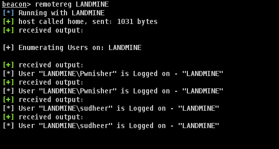

Beacon Object File to query logged on users on remote Servers/VDI/DC etc. Uses remote registry API to query the data.

#### usage:

Load the aggresor script - remotereg.cna using the script editor 

 beacon> remotereg MSRV01.rexcorp.com

